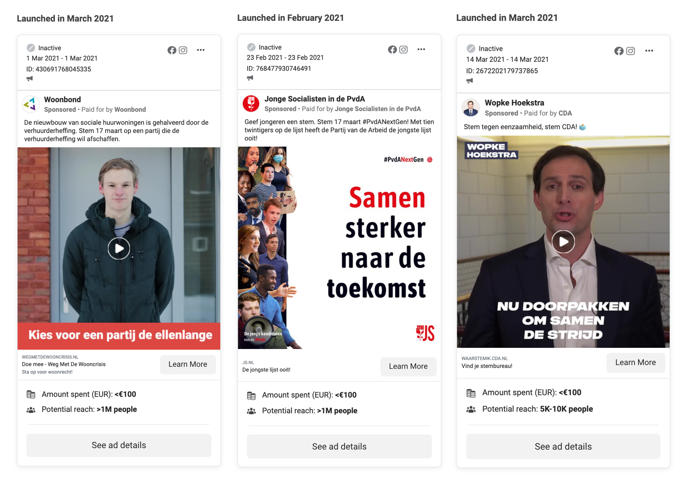
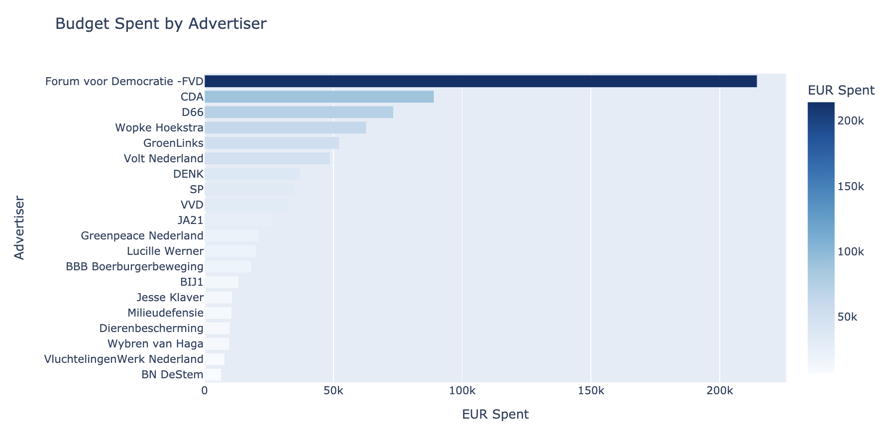
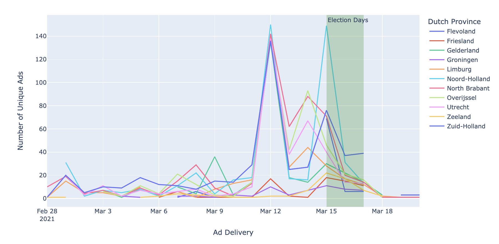

[](./requirements.txt)
[](./LICENSE)
[](https://zenodo.org/badge/latestdoi/387397007)

---

# Facebook Ads Data Analysis

Methodologies and limitations of using the Facebook Graph API to access the Facebook Ads library performing data analysis on the 2021 Dutch General Elections getting key insights of advertisement practices.  
[See the full analysis here](https://nbviewer.jupyter.org/github/pedrohserrano/facebook-ads-library-netherlands/blob/master/Facebook_Ads_API.ipynb)




The Dutch general elections took place from 15 to 17 March 2021 to elect all 150 members of the House of Representatives[1](https://www.rijksoverheid.nl/actueel/nieuws/2020/10/30/vervroegd-stemmen-wordt-mogelijk-bij-tweede-kamerverkiezingen-2021).  

This was already an especial circumstance since the election had originally been scheduled to take place on 17 March. However, due to the COVID-19 pandemic, the government decided to open some polling stations two days in advance to ensure safe voting for elderly and immunocompromised citizens. Citizens aged 70 years or older were also given the opportunity to vote by post.




---

## Software

This works contains an out-of-the-box Python scraper for the Facebook Ads Library, using the official [Facebook Ad Library API](https://www.facebook.com/ads/library/api/). 

**What to expect?**

- The scraper is one file: `fb_ad_lib_scraper.py`
- This script will **ONLY** work for users who have been approved for access to the API via Facebook. 
- This script performs data transformation i.e. unnesting messy JSON to pretty data tables
- This script will impute 0 for missing demographics and regions
- The intent of this tool is to investigate political advertisements practices on Facebook
- It "should" **ONLY** be used for research and analysis, not for monetary gain. 
- The data analisys is one file: `Facebook_Ads_API.ipynb` [See the full analysis here](https://nbviewer.jupyter.org/github/pedrohserrano/facebook-ads-library-netherlands/blob/master/Facebook_Ads_API.ipynb)
- The data used for this analysis in the data folder, if you run the analysis the data will be overwritten.
- Facebook **ONLY** allows to retrieve ads about `Social Issues, Elections or Politics`, or `Maatschappelijke kwesties, verkiezingen of politiek` in Dutch.

---

## Usage


In order to use the API, one need to gain access to the Facebook Ads Library API at [facebook.com/ID](https://www.facebook.com/ID) and confirm your identity.

The configuration of the API call relies entirely in the configuration file `config.yaml`. 

1. Register as a developer at [developers.facebook.com](https://developers.facebook.com/)
2. Go to [Graph API explorer](https://developers.facebook.com/tools/explorer) and create an app
3. Having a new app ID. Create a Token for the new app in the UI.
4. Copy the token to the empty `TOKEN.txt` file
5. Adjust the `config.yaml` file
6. Install and run

**Install**
```sh
pip3 install requests tqdm plotly
```

**Run**

```sh
python3 fb_ad_lib_scraper.py
```

---

## Data Output

This script outputs three CSV files in an ideal format to be analyzed.  

- `fb_ads.csv`: The raw ads and their metadata.  
- `fb_ads_demos.csv`: The unnested demographic distributions of people reached by ads, which can be mapped to fb_ads.csv via the ad_id field.  
- `fb_ads_regions.csv`: The unnested region distributions of people reached by ads, which can be mapped to fb_ads.csv via the ad_id field.  

In this analysis we extracted over 8000 inactive ads by querying "stem" ("to vote" in Dutch) filtering therefore the ones related to the elections and setting a manageable limit for the API. The outputs lay in the [data folder](https://github.com/pedrohserrano/facebook-ads-library-netherlands/tree/master/data).

---

## Data Analysis

In this pilot data analysis, advertisement data has been collected on more than 8k ads using Facebook's Ad Library API. including the period range around the Dutch General Elections in 2021, i.e. January to April 2021, all campaigns collected were inactive ones. The party CDA was by far the one with more unique ads created with more than 2k, followed by smaller parties like Volt with 409 and DENK with 329. Furthermore, CDA spent up to 150,000 Euros on campaigns it wasn't the one that spent the most. Forum voor Democratie (FVD) spent up to 220,000 Euros in ads campaigns. Marketers choose the last Friday before the election days (March 12) to launch the majority of the campaigns (3-4 days prior to voting). [See the full analysis here](https://nbviewer.jupyter.org/github/pedrohserrano/facebook-ads-library-netherlands/blob/master/Facebook_Ads_API.ipynb)



---

## Maintainer

This analysis was made possible due to the amazing Max Woolf's ([@minimaxir](https://minimaxir.com)) Facebook API Ads scrapper. In the [original repository](https://github.com/minimaxir/facebook-ad-library-scraper) one can find examples on the US ads. Please contribute to his work!!

*Max's open-source projects are supported by his [Patreon](https://www.patreon.com/minimaxir) and [GitHub Sponsors](https://github.com/sponsors/minimaxir). If you found this project helpful, any monetary contributions to the Patreon are appreciated and will be put to good creative use.*

---
**Copyright (C) 2021, Pedro V Hernandez Serrano**

[MIT License](https://github.com/pedrohserrano/facebook-ads-library-netherlands/blob/master/LICENSE)
